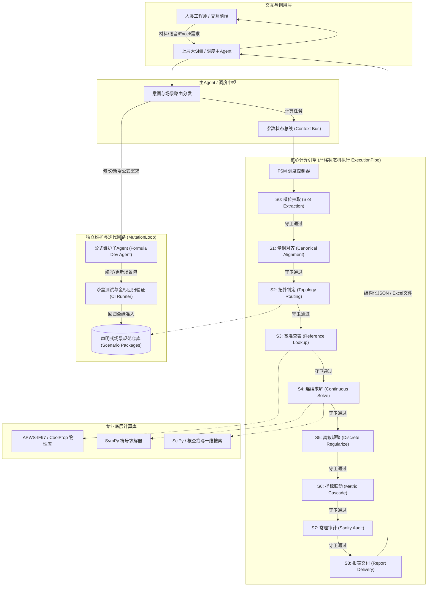
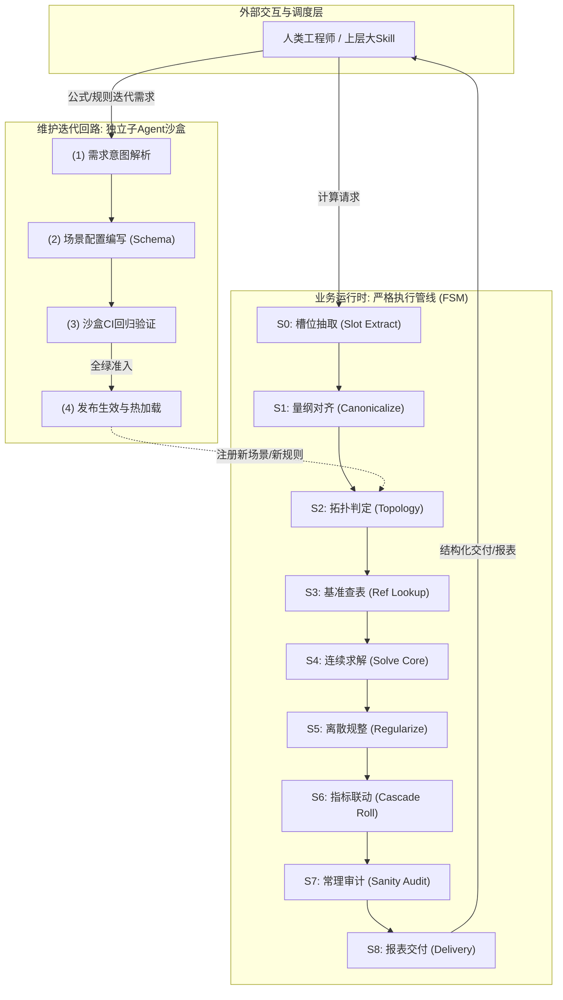
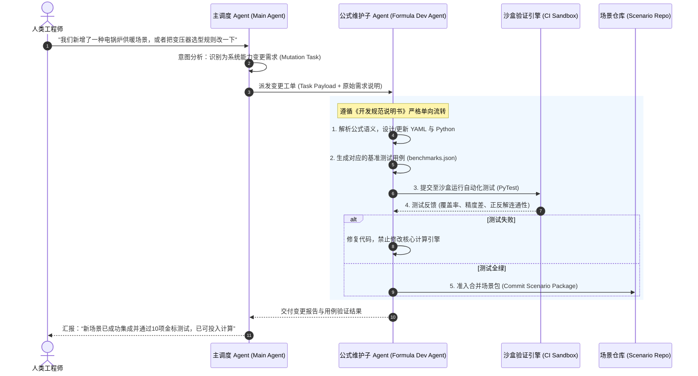

# 工业智能计算 Skill (Industrial Calculation Engine) 详细架构与系统设计说明书

---

## 1. 架构总览与设计哲学

本 Skill 旨在解决工业工程设计、工艺热工计算、设备选型与经济造价评估中**长链条、高自由度、多模态输入以及复杂双向反解**的自动化计算需求。

为彻底杜绝大模型在数值计算中常见的“幻觉”、“随意跳过计算步骤”、“修改代码引入技术债（堆史山）”等问题，系统确立三大设计哲学：

1. **计算确定性与符号解耦 (Deterministic Engine & Symbolic Decoupling)**：
   大语言模型 (LLM) **绝不直接进行浮点数学运算**。LLM 仅负责自然语言实体抽取、歧义澄清、量纲归一化与场景调度。所有实际计算交由确定性计算内核（符号代数、热力学物性库、离散规则引擎）执行。
2. **确定有限状态机强约束 (Strict Finite State Machine Pipeline)**：
   计算流程抽象为强类型状态机。每个步骤具有显式的输入前置契约 (Pre-conditions)、状态转移守卫 (Guards) 和后置验证不变量 (Invariants)。禁止跳步，单步验证未通过立即回退或请求补充参数。
3. **主子 Agent 双环隔离与沙盒维护 (Dual-Loop Main/Sub-Agent Architecture)**：
   业务计算链路（Runtime Loop）与公式迭代维护链路（Authoring Loop）物理隔离。AI 扩展新公式必须通过独立的**公式维护子 Agent (Formula Dev Sub-Agent)**，遵循声明式规范包在受控沙盒中开发并通过全量金标回归测试，严禁直接篡改核心引擎代码。

---

## 2. 整体系统拓扑图 (Topology)



---

## 3. 通用状态机流水线设计 (Universal Execution FSM)

针对各类计算报表（无论是工程热工设备选型、企业商业财务利润表，还是通用代数方程求解），计算过程均遵循**不可随意跳步、单步强校验**的确定有限状态机 (FSM)。

### 3.1 业务运行与维护迭代双环拓扑



### 3.2 通用状态规格定义表 (Domain-Agnostic Specification)

状态机调度器 (FSM Controller) 负责在每一步严格校验前置契约 (Pre-conditions) 与后置不变量 (Invariants)，禁止任何隐式跳步：

| 状态 ID | 状态名称 | 通用核心职责 | 前置守卫 (Guard) | 核心动作 (Action) | 后置不变量 (Invariant) | 异常阻断与回退 |
| :--- | :--- | :--- | :--- | :--- | :--- | :--- |
| **S0** | `SLOT_EXTRACTION` | 原始槽位提取 | 输入材料非空（文本/文件/表格片段） | 实体与意图抽取，捕获原始粗颗粒度变量名、数值与工况描述 | 槽位解析完整度达标；未识别上下文存入补充池 | 无法抽取任何有效参数时终止并提示输入材料无效 |
| **S1** | `CANONICAL_ALIGNMENT` | 变量归一与量纲对齐 | S0 槽位抽取就绪 | 别名映射至标准化变量名；强制换算至标准量纲/基准货币/物理量单位；检查缺失项 | 变量名全局唯一规范；全部数值具备显式量纲；消除同义歧义 | 核心自变量缺失时，生成精准提问表单中断等待澄清 |
| **S2** | `TOPOLOGY_ROUTING` | 依赖分析与求解路径判定 | S1 规范参数有效，场景规则已加载 | 构建计算依赖有向无环图 (DAG)，结合已知量集合与目标量集合判定求解路径（正向推进、单/多变量反向逆解、联立方程） | 方程自由度 (DoF) 闭合等于 0；形成可执行确定性求解顺序拓扑 | 欠约束 (DoF>0) 追问缺失约束；过约束 (DoF<0) 报出矛盾参数 |
| **S3** | `REFERENCE_LOOKUP` | 基准查表与外部规则加载 | 状态点或分类维度输入完备 | 依据已确定参量，检索外部基础参照表（如热工物性表、行业税率/利率表、材料密度/常数库、定价区间表等） | 查询结果无空值、无越界；插值或查表参数处于有效定义域内 | 参量超出基准表有效边界时，阻断并报告超限预警 |
| **S4** | `CONTINUOUS_SOLVE` | 核心方程与连续平衡求解 | 基准参数与连续自变量就绪 | 求解核心代数方程组或连续平衡关系（符号代数解析求根、迭代求解、能量/财务收支平衡），支持双向反解 | 方程组平衡残差 $< 10^{-6}$；关键未知量获得确定数值解 | 迭代不收敛或无实数解，输出不可行原因并回退 |
| **S5** | `DISCRETE_REGULARIZE` | 离散规整与阶梯规则映射 | S4 连续计算结果有效 | 执行非连续、阶梯或分段工程规则（如规格向上取整 ROUNDUP、阶梯分档单价/税率匹配、标准选型规格匹配） | 输出规格/档位严格属于预设离散集合；满足单向安全包络 | 超出规格最大极值时触发组合并联或溢出告警 |
| **S6** | `METRIC_CASCADE` | 综合指标联动与报表聚合 | S5 离散规整数据完备 | 自底向上执行衍生指标级联计算、费率联动计算、中间汇总与总计汇总 | 静态平衡与分项求和严格自洽；报表层级勾稽关系 100% 成立 | 勾稽平衡不一致触发公式链条检查 |
| **S7** | `SANITY_AUDIT` | 业务不变量与合理性审计 | S6 全部输出指标生成 | 执行业务守恒性与合理性边界审查（物理守恒、温差/压力夹点、借贷平衡、利润非负、关键比率区间） | 领域审计规则 100% 绿灯无致命违规 (No Fatal Violations) | 审计拦截违规项，输出不符合工程/商业常理的根因 |
| **S8** | `REPORT_DELIVERY` | 结构化交付与多模态导出 | S7 审计全绿通过 | 封装标准 JSON 返回报文；依据模板渲染填报 Excel（保留原生公式）并生成 Markdown 摘要报表 | 交付产物完整包含输入、中间量、选型/分项及汇总结果 | 写入持久化存储，向上层大 Skill 或人类终端交付 |

---

### 3.3 多领域业务映射落地矩阵 (Multi-Domain Mapping Matrix)

通用状态机如何适配不同的报表场景？以下三类典型计算场景展示了统一状态机的落地方式：

| 状态机节点 | 场景 A：工业工程热工与设备选型 (如熔盐供汽) | 场景 B：企业财务与商业利润测算报表 | 场景 C：通用多元约束代数 (任意代数方程组及反解) |
| :--- | :--- | :--- | :--- |
| **S0 槽位抽取** | 提取蒸发量、蒸汽压力、给水温度、谷电时长等 | 提取产品单价、销量、研发投入、固定资产原值等 | 提取已知变量名与数值（如给定 $a=10, b=5, d=30$） |
| **S1 量纲对齐** | 统一为标准制（`MPa`, `℃`, `t/h`, `h`） | 统一货币单位（`万元`/`元`）、会计年度、计税口径 | 统一代数符号系统与有效数字精度 |
| **S2 拓扑判定** | 判定是正向算功率造价，还是由总投资反推产汽量 | 判定是正向算净利润，还是根据目标利润反推降本空间 | 判定已知量集合与待求量（求未知数 $c$），确定求解路径 |
| **S3 基准查表** | 查水水蒸气焓值表 (IAPWS-IF97)、熔盐物性多项式 | 查增值税率、企业所得税率、LPR贷款基准利率、折旧年限 | 加载数学常数或预设约束边界条件 |
| **S4 连续求解** | 求解热平衡 $Q=D\Delta h$、理论吸热与加热功率 | 求解营业收入、营业成本、毛利、EBITDA、利息费用 | 符号求解器求解 $c = d - a - b$，输出解析解或根 |
| **S5 离散规整** | 电加热器 5MW 步长取整、变压器标准型谱 (MVA) 档位匹配 | 超额累进所得税分档、阶梯计费区间、折旧月份整数规整 | 向上/向下取整函数、离散步长限制映射 |
| **S6 指标联动** | 分项造价汇总、工程概算费率联动、动态投资利息核算 | 三表联动、税后净利润核算、自由现金流折现、IRR / ROI | 汇总求和项、残差计算与校验和输出 |
| **S7 常理审计** | 换热夹点温差校验（防温度交叉）、变压器裕量校验 | 资产负债平衡校验、无资金链断裂断点、毛利率合理性校验 | 变量定义域校验（分母非零、开方非负、对数真数大于零） |
| **S8 报表交付** | 填报 7-Sheet 工程概算 Excel 表格、结构化方案 JSON | 输出标准三表利润分析 Excel、财务敏感性 Markdown 报告 | 输出规范化解集 JSON 与代数推导过程步骤说明 |
---

## 4. 全向与双向反解引擎架构 (Bidirectional Inversion Engine)

工业与商业场景中计算灵活性要求极高（支持任意多元代数方程组 $F(x_1, x_2, \dots, x_n) = 0$ 中给定任意独立已知参数集合反解目标未知量，以及由最终动态总投资反推最大产能规模等跨层级反解）。
### 4.1 双向求解分层策略

系统将变量与公式划分为两个数学域，采用**分层混合求解器 (Hierarchical Hybrid Solver)**：

```
                    ┌──────────────────────────────────────────────┐
                    │  连续代数与物理域 (Continuous Physical Domain)  │
                    │  (流量、压力、温度、焓值、连续热量、理论功率)    │
                    └──────────────────────┬───────────────────────┘
                                           │  解析符号反解 / 雅可比迭代
                                           ▼
                    ┌──────────────────────────────────────────────┐
                    │  离散阶梯与经济域 (Discrete Engineering Domain)│
                    │  (ROUNDUP取整、分档单价、标准变压器档位、总投资)  │
                    └──────────────────────────────────────────────┘
```

#### 策略 A：连续代数层 —— 符号计算图 (SymPy Symbol Graph)
- **机制**：场景中的物理与连续能量方程统一定义为零点隐函数集合 $\{ f_i(x_1, x_2, \dots, x_n) = 0 \}$。
- **正反解判定**：
  给定已知变量集合 $K \subset X$，求解目标集合 $T \subset X$。
  1. 符号求解器检测方程拓扑，自动尝试解析求解：$x_t = g(K)$；
  2. 若存在强非线性（如包含物性库隐式查表 $h = \text{CoolProp}(P, T)$），自动退化为一维/多维非线性根查找器（`scipy.optimize.root_scalar` 或 `brentq`）。

#### 策略 B：混合离散与造价层 —— 区间二分与单调性穿透 (Monotonic Inversion)
- **痛点**：设备选型包含向上取整函数 `ROUNDUP`、条件选择 `IFS` 和分档阶梯单价，导数不存在或局部为 0，解析反解无法直接使用。
- **工程解法**：
  在工程逻辑中，**工艺规模参数（如蒸汽流量 $D$）与总投资额 $C_{total}$ 具有严格的单调递增性**。
  当用户提出反解需求（如：已知总投资限额反求产汽流量，或已知目标利润反求可变成本预算）：
  1. 求解器确立工艺规模自变量 $x$ 的物理/业务搜索边界 $[x_{min}, x_{max}]$；
  2. 调度前向全流程计算管线（S3 基准查表 $\to$ S4 连续求解 $\to$ S5 离散规整 $\to$ S6 指标联动）作为一个评估函数：$y = \text{EvaluatePipeline}(x)$；
  3. 执行**带阶梯感知的二分法 (Interval Step Bisection)** 或黄金分割搜索，在极低时间开销内（$<100\text{ms}$，纯代码编译执行）锁定满足 $y(x) \le y_{target}$ 的最优解，同时输出阶梯跳跃临界点。
---

## 5. 声明式场景包规范 (Declarative Scenario Schema)

为杜绝“AI 在 Skill 中堆砌史山代码”，所有计算场景必须以标准化、模块化、自描述的独立包形式组织。**核心引擎仅提供解析器，场景包完全数据化与配置化**。

### 5.1 目录组织结构

```
skills/calculate/scenarios/
└── molten_salt_steam/                # 场景唯一标识 (Scenario ID)
    ├── manifest.yaml                 # 场景元数据、参数字典、量纲与默认值
    ├── continuous_equations.py       # 符号方程与物理守恒定义
    ├── property_bindings.py          # 专业物性查表函数挂载
    ├── discrete_sizing.json          # 设备选型规格库与阶梯档位表
    ├── costing_rules.yaml            # 概算分项系数与阶梯单价规则
    ├── excel_template.xlsx           # 导出的标准 Excel 模板与单元格映射
    └── benchmarks.json               # 金标回归测试集 (包含正解/反解/边界用例)
```

### 5.2 规范文件具体定义示例

#### (1) `manifest.yaml` (参数元数据与量纲强约束)
```yaml
scenario_id: "molten_salt_steam"
version: "1.0.0"
name: "谷电熔盐储热供蒸汽系统全流程计算"
description: "根据蒸汽参数、给水参数及电价谷电时长，计算加热功率、储热量、选型及工程投资概算"

parameters:
  steam_pressure_mpa:
    type: "float"
    canonical_unit: "MPa"
    aliases: ["蒸汽压力", "主汽压", "压力", "供汽压力"]
    description: "供汽端蒸汽表压/绝压"
    bounds: [0.1, 25.0]
    default: 1.5
    required: true

  steam_temperature_c:
    type: "float"
    canonical_unit: "degC"
    aliases: ["蒸汽温度", "供汽温度", "主汽温"]
    description: "供汽过热/饱和蒸汽温度"
    bounds: [100.0, 600.0]
    default: 200.0
    required: true

  steam_flow_th:
    type: "float"
    canonical_unit: "t/h"
    aliases: ["蒸汽流量", "产汽量", "供汽能力", "每小时吨数"]
    description: "小时供汽流量"
    bounds: [0.1, 5000.0]
    required: true

  steam_supply_hours_h:
    type: "float"
    canonical_unit: "h"
    aliases: ["供汽时长", "供热小时数"]
    bounds: [1.0, 24.0]
    default: 8.0

  valley_power_hours_h:
    type: "float"
    canonical_unit: "h"
    aliases: ["谷电时长", "消纳谷电时长", "电加热工作时长"]
    bounds: [1.0, 24.0]
    default: 8.0

  total_investment_wanke:
    type: "float"
    canonical_unit: "万元"
    aliases: ["总投资", "工程总投资", "动态投资", "投资概算"]
    description: "工程项目最终动态总投资"
    bounds: [0.0, 1000000.0]
    is_target_candidate: true
```

#### (2) `discrete_sizing.json` (工程离散型谱表)
```json
{
  "electric_heater": {
    "step_mw": 5.0,
    "min_mw": 5.0,
    "max_mw": 80.0,
    "rule": "CEIL_TO_STEP"
  },
  "transformer_mva": {
    "standards": [6.3, 8.0, 10.0, 12.5, 16.0, 20.0, 25.0, 31.5, 40.0, 50.0, 63.0, 90.0, 120.0],
    "rule": "NEXT_GREATER_OR_EQUAL",
    "power_factor": {
      "heater": 1.0,
      "heat_pump": 0.85
    }
  }
}
```

---

## 6. AI 自动化迭代与独立子 Agent 维护机制

为实现用户第 4 点需求——“增加让AI自己迭代工具的功能，提供说明书，规范化AI操作，主Agent调用子Agent实现修改”，建立**自迭代生命周期管理**。

### 6.1 主 Agent 与子 Agent 职责隔离协议



### 6.2 开发者与 AI 必须遵守的操作准则说明书 (AI Manual)

维护子 Agent 系统提示词中内嵌以下铁律：

```markdown
# 工业计算场景自动化维护与迭代规范守则 (Formula Dev Agent Manual)

## 核心红线 (Inviolable Rules)
1. 【禁止修改引擎内核】：严禁修改 `engine/core/` 目录下的状态机调度器、符号解析器及外部适配层代码。所有改动必须限制在 `scenarios/<scenario_id>/` 目录内。
2. 【必须显式声明量纲】：所有新增参数必须指定 `canonical_unit`，禁止出现没有物理单位的“纯数字参数”。
3. 【禁止随意发明命名】：变量名必须采用英文蛇形命名法 (`snake_case`)，并在后缀明确物理量性质（如 `_mpa`, `_c`, `_th`, `_mw`）。
4. 【金标回归测试硬门禁】：任何修改必须附带至少 3 组基准用例（常规正解用例、边界值用例、目标反解用例）。沙盒测试未达到 100% 通过率，严禁发布。

## 场景新增标准步骤 (6-Step Lifecycle)
1. 步骤一 (Schema 定义)：根据需求编写 `manifest.yaml`，补全中英文别名、上下边界及单位。
2. 步骤二 (代数建模)：在 `continuous_equations.py` 中使用声明式函数注册能量守恒关系。
3. 步骤三 (规则配置)：在 `discrete_sizing.json` 与 `costing_rules.yaml` 中配置离散规格及费率。
4. 步骤四 (金标用例合成)：在 `benchmarks.json` 中录入已知权威数据（例如来自人工核算 Excel 表格）。
5. 步骤五 (沙盒回归)：运行 `pytest tests/test_scenario_regression.py --scenario=<scenario_id>`。
6. 步骤六 (审计与自查)：输出变更日志与变量拓扑图，确认无孤岛变量与死循环循环引用。
```

---

## 7. 上层大 Skill 集成接口标准 (API Contract)

本 Skill 具备自描述性 (Self-describing)，上层大 Skill 可将其作为标准的专业工具调用。

### 7.1 工具发现接口 (Tool Discovery)

#### `list_scenarios`
返回当前所有可用计算场景及其摘要。
```json
{
  "scenarios": [
    {
      "id": "molten_salt_steam",
      "name": "谷电熔盐储热供蒸汽计算",
      "version": "1.0.0",
      "description": "支持电加热器/热泵双方案、水蒸气物性查表、设备选型与全过程工程造价概算"
    }
  ]
}
```

#### `get_scenario_spec`
输入 `scenario_id`，返回该场景完整的输入槽位、目标参数、边界以及别名映射表（供上层大 Skill 组织 Prompt 或校验用户输入）。

### 7.2 核心计算调用接口 (Execution Contract)

#### `calculate`
上层大 Skill 发起调用的核心接口：

**请求 Payload：**
```json
{
  "scenario": "molten_salt_steam",
  "inputs": {
    "steam_pressure_mpa": 1.5,
    "steam_temperature_c": 200.0,
    "steam_flow_th": 100.0,
    "feedwater_pressure_mpa": 0.1,
    "feedwater_temperature_c": 20.0,
    "steam_supply_hours_h": 8.0,
    "valley_power_hours_h": 8.0,
    "operating_days_d": 330
  },
  "targets": [
    "electric_heater_power_mw",
    "storage_capacity_mwh",
    "molten_salt_mass_t",
    "total_investment_wanke"
  ],
  "options": {
    "solution_mode": "AUTO",       // AUTO (自动推断正反向) / FORWARD / INVERSE
    "generate_excel": true,        // 是否在磁盘落地完整 .xlsx
    "audit_level": "STRICT"        // 审计级别：STRICT (遇警告中断) / PERMISSIVE
  }
}
```

**响应 Payload：**
```json
{
  "status": "SUCCESS",
  "execution_id": "calc_exec_20261009_001",
  "scenario": "molten_salt_steam",
  "fsm_trace": [
    {"state": "S0_SLOT_EXTRACTION", "status": "PASSED"},
    {"state": "S1_CANONICAL_ALIGNMENT", "status": "PASSED"},
    {"state": "S2_TOPOLOGY_ROUTING", "mode": "FORWARD", "status": "PASSED"},
    {"state": "S3_REFERENCE_LOOKUP", "status": "PASSED"},
    {"state": "S4_CONTINUOUS_SOLVE", "status": "PASSED"},
    {"state": "S5_DISCRETE_REGULARIZE", "status": "PASSED"},
    {"state": "S6_METRIC_CASCADE", "status": "PASSED"},
    {"state": "S7_SANITY_AUDIT", "business_rules_check": "PASSED", "status": "PASSED"},
    {"state": "S8_REPORT_DELIVERY", "status": "PASSED"}
  ],
  "results": {
    "thermodynamics": {
      "steam_enthalpy_kj_kg": 2795.98,
      "feedwater_enthalpy_kj_kg": 84.01,
      "sgs_thermal_power_mw": 75.33
    },
    "energy_and_storage": {
      "heat_produced_mwh": 608.75,
      "storage_capacity_mwh": 614.90,
      "molten_salt_mass_t": 8650.0
    },
    "equipment_sizing": {
      "heater_power_nominal_mw": 80.0,
      "transformer_capacity_mva": 90.0
    },
    "economic_estimation": {
      "equipment_investment_wanke": 17320.0,
      "static_investment_wanke": 21650.0,
      "dynamic_investment_wanke": 22650.0
    }
  },
  "artifacts": {
    "excel_report_path": "/exports/molten_salt_steam_result_20261009_001.xlsx",
    "markdown_summary": "### 谷电熔盐储热项目测算报告\n..."
  }
}
```

---

## 8. 热工物性与 Excel 报表映射实现细节

### 8.1 专业热工物性底层支持 (IAPWS / CoolProp)
针对水蒸气物性（如 `输入输出.xlsx` 中调用的 `enthalpy("water","PT",...)`）：
- 运行环境中自动加载 `iapws`（实现水和水蒸气热力性质工业计算标准 IAPWS-IF97）或 `CoolProp`：
  ```python
  from iapws import IAPWS97
  
  def calc_water_steam_enthalpy(pressure_mpa: float, temp_c: float) -> float:
      """
      依据压力(MPa)与温度(℃)计算水或水蒸气焓值 (kJ/kg)
      """
      # IAPWS97 参数单位：P 为 MPa，T 为 K
      state = IAPWS97(P=pressure_mpa, T=temp_c + 273.15)
      return state.h  # 返回 kJ/kg
  ```
- 熔盐（HITEC 熔盐与太阳盐）物理化学物性采用严格分段多项式函数库，支持温度依赖性计算（密度、比热、导热系数、动力粘度）。

### 8.2 Excel 报表自动生成与单元格联动映射
对于交付物需求中要求生成的 `.xlsx` 文件：
- 采用无损模板复写技术（基于 `openpyxl`）：
  保留原始模板所有的格式、样式、图表、字体、公式及打印属性；
- 数据回填分为两层：
  1. **输入层单元格回填**：将规范化后的输入参数写入 `输入` 工作表对应单元格（例如 `D2`、`D3` 等）；
  2. **公式保留与值写入**：不仅写入计算出的静态浮点值，同时保持 Excel 原生公式（如 `SUM(C3:C10)`、`ROUNDUP(...)`），确保输出报表在 Excel 软件打开时支持人工二次二次调参和实时公式响应。

---

## 9. 异常分类与自愈状态转移策略

在严格状态机流水线中，针对现实中常见的各种输入边界与计算异常，设计完备的防御与自愈闭环：

```
                    ┌───────────────────────────────────┐
                    │          异常发生拦截点           │
                    └─────────────────┬─────────────────┘
                                      │
         ┌────────────────────────────┼────────────────────────────┐
         ▼                            ▼                            ▼
  【输入/量纲层异常】          【代数求解/查表越界异常】     【业务不变量/审计异常】
   - 严重缺参/语义歧义         - 查表参数超出基准定义域      - 守恒性校验不闭合
   - 单位/量纲无法解析         - 方程组不收敛/无可行解       - 违反领域物理/商业常理
         │                            │                            │
         ▼                            ▼                            ▼
  状态机中断于 S1             状态机中断于 S3/S4           状态机中断于 S7
  生成特定补充提问表单         给出越界参量与方程残差根因    输出违背领域常理的根因建议
  (向人类/上层Agent追问)      (提示调整工艺工况或财务假设)   (给出安全边界或容差建议)
```

---

## 10. 交付物与演进路线 (Deliverables Roadmap)

- **Phase 1: 核心 FSM 调度器与基础代数求解器 (`engine/core/`)**
  - 确定有限状态机运行时与状态守卫机制
  - 符号求解图与非线性单调二分反解器
- **Phase 2: 物性服务与 Excel 模板引擎 (`engine/properties/`, `engine/exporter/`)**
  - 集成 IAPWS-IF97 物性计算模块与熔盐多项式库
  - 实现基于 `输入输出.xlsx` 的多 Sheet 结构化填充导出器
- **Phase 3: 熔盐储热工程标杆场景包 (`scenarios/molten_salt_steam/`)**
  - 完备对齐 `输入输出.xlsx` 全部 7 个 Sheet 的参数、离散选型与概算联动
  - 100% 通过金标回归测试集
- **Phase 4: 独立维护子 Agent (Formula Dev Agent) 及其规范与沙盒环境**
  - 子 Agent 开发手册与系统 Prompt 固化
  - 场景包自动化合规审计与测试套件 (CI Sandbox)
