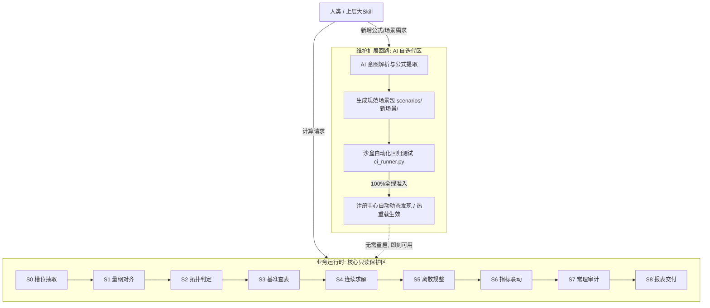

# AI 新增计算场景与公式扩展操作指南 (AI Scenario Extension Guide)

> **【面向对象】**：本指南面向**上层大 Skill 调度器、主 Agent 及代码开发/维护子 Agent (Formula Dev Sub-Agent)**。
> **【核心目标】**：指导 AI 如何在**不修改核心引擎、不堆砌史山代码**的前提下，安全、标准、自动化地为本工具**新增计算场景与各类数学/物理/商业公式**。

---

## 1. 架构扩展哲学与双环隔离原则

本项目实行**业务运行 (ExecutionPipe)** 与 **公式维护 (MutationLoop)** 物理隔离：



### 核心红线 (Inviolable Rules)
1. **核心引擎免动**：严禁修改 `engine/` 目录下的任何状态机与求解调度代码；
2. **场景物理隔离**：每个新计算场景独立封装在 `scenarios/<scenario_id>/` 目录下；
3. **测试全绿准入**：新公式必须附带 `benchmarks.json` 测试用例，且在沙盒中通过全量回归测试方可正式激活上线。

---

## 2. 方式一：Python 编程式一键新增 (推荐主 Agent 调度)

主 Agent 或大 Skill 在对话过程中提取出人类的新公式需求后，可直接调用 `CalculationSkill.create_scenario(...)` 一键完成创建、沙盒自检与热加载：

### 调用代码示例：
```python
from skill_api import CalculationSkill

skill = CalculationSkill()

# 1. 声明参数与量纲 (所有参数必须附带 canonical_unit)
parameters = {
    "solar_capacity_mw": {
        "type": "float",
        "canonical_unit": "MW",
        "description": "光伏电站装机容量",
        "bounds": [0.1, 10000.0],
        "required": True,
        "aliases": ["光伏装机", "装机容量", "光伏容量"]
    },
    "equivalent_hours_h": {
        "type": "float",
        "canonical_unit": "h",
        "description": "年等效利用小时数",
        "bounds": [500.0, 3000.0],
        "default": 1300.0,
        "aliases": ["利用小时", "等效小时"]
    },
    "system_efficiency": {
        "type": "float",
        "canonical_unit": "/",
        "description": "光伏电站系统综合效率 (PR)",
        "bounds": [0.5, 1.0],
        "default": 0.82,
        "aliases": ["PR值", "系统效率"]
    }
}

# 2. 编写纯代数方程 (pure python functions)
equations_code = '''"""光伏发电量核算纯函数"""

def calc_annual_generation_mwh(solar_capacity_mw: float, equivalent_hours_h: float, system_efficiency: float = 0.82) -> float:
    """年上网发电量 (MWh) = 容量 * 等效小时 * PR"""
    return round(solar_capacity_mw * equivalent_hours_h * system_efficiency, 2)
'''

# 3. 编写金标回归测试用例 (供沙盒门禁核验)
benchmarks = [
    {
        "case_id": "pv_generation_standard_case",
        "description": "100MW光伏电站基准发电量核算",
        "mode": "FORWARD",
        "inputs": {
            "solar_capacity_mw": 100.0,
            "equivalent_hours_h": 1300.0,
            "system_efficiency": 0.82
        },
        "expected": {
            "annual_generation_mwh": 106600.0
        },
        "tolerance": 0.001
    }
]

# 4. 执行创建 (自动跑测试并热加载上线)
result = skill.create_scenario(
    scenario_id="solar_pv_generation",
    name="集中式光伏电站发电量测算模型",
    description="根据光伏装机容量、光照利用小时数与系统效率测算首年及年均上网电量",
    parameters=parameters,
    equations_code=equations_code,
    benchmarks=benchmarks,
    auto_test_and_register=True
)

print(result["status"])  # 成功返回 "SUCCESS"
print(result["message"]) # "场景 [solar_pv_generation] 已成功创建并通过全部沙盒回归测试，已热重载生效！"

# 5. 立即调用执行计算
calc_res = skill.calculate(
    scenario_id="solar_pv_generation",
    inputs={"光伏装机": 50.0, "利用小时": 1500.0}
)
print("计算结果:", calc_res["results"]["annual_generation_mwh"])  # 61500.0
```

---

## 3. 方式二：文件直写与沙盒回归流程 (推荐子 Agent 协同开发)

若子 Agent 以文件编写模式协作，需按以下标准步骤进行：

### 步骤 1：新建场景目录
在 `scenarios/` 下创建新目录，名称必须为蛇形小写：
```
scenarios/<scenario_id>/
├── manifest.yaml          # [必需] 参数、别名、单位声明
├── equations.py           # [必需] 纯函数代数方程
├── sizing_rules.json      # [可选] 离散取整与选型规则
├── costing_rules.yaml     # [可选] 费率与阶梯单价
├── benchmarks.json        # [必需] 权威测试用例集
├── spec.py                # [必需] 继承 BaseScenarioSpec 的规范类
└── README.md              # [必需] 场景业务与工艺说明
```

### 步骤 2：编写核心文件
- 详细语法格式参考 **`docs/SCENARIO_SCHEMA_SPEC.md`**；
- `spec.py` 必须继承 `scenarios.base.BaseScenarioSpec`。

### 步骤 3：在沙盒中执行回归测试 (硬门禁)
在当前项目环境下运行 CI 脚本：
```powershell
.\.venv\Scripts\python.exe subagent_workspace/ci_runner.py <scenario_id>
```
- **通过标准**：所有测试用例差异在 `tolerance` 内，输出 `[PASSED] 100% 通过，准入发布!`；
- **失败处置**：若未通过，必须根据打印的误差与残差信息修正 `equations.py` 或 `benchmarks.json`。

### 步骤 4：热重载生效
在 Python 中调用：
```python
from scenarios.registry import ScenarioRegistry
ScenarioRegistry.reload()  # 自动扫描并加载所有 scenarios/ 下的子包
```
无需重启 Python 解释器或重构核心系统。

---

## 4. 常见扩展场景示例速查

| 扩展领域 | 典型场景 ID | 核心公式类型 | 关键输入与单位 | 典型输出与单位 |
| :--- | :--- | :--- | :--- | :--- |
| **新能源与储能** | `bess_energy_storage` | 充放电能量守恒、衰减模型 | 储能规模 (`MW/MWh`)、充放电倍率 (`C`) | 循环寿命、充放电量 (`MWh`) |
| **碳中和与环保** | `carbon_emission_calc` | 排放因子乘积法、核减碳量 | 煤耗量 (`t`)、网电量 (`MWh`)、因子 | 总碳排放 (`t CO2e`) |
| **设备传热核算** | `plate_heat_exchanger` | 对数平均温差 (LMTD)、传热方程 | 进出口温差 (`℃`)、流量 (`t/h`) | 换热面积 (`m²`)、传热量 (`kW`) |
| **财务经济测算** | `lcoe_discount_model` | 净现值折现方程 (NPV=0 反解) | 建设投资 (`万元`)、O&M费、折现率 | 平准化度电成本 (`元/kWh`) |

通过上述机制，AI 既可以充当计算的使用者，也可以在严格沙盒保护下成为工具的扩充开发者，实现了可持续的自动化工具自演进。
