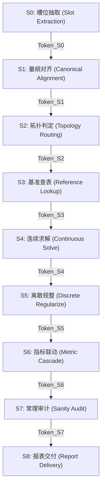

# 通用有限状态机流水线协议规范 (State Machine Pipeline Specification)

本文档定义智能计算引擎运行时执行管线 (ExecutionPipe) 中 **S0 至 S8 各状态的严格前后置契约、守卫条件 (Guards)、后置不变量 (Invariants) 与状态令牌 (StateToken) 协议**。

---

## 1. 状态机总控协议与上下文总线

所有状态间的数据流转均通过唯一的 **`ExecutionContext` (执行上下文状态总线)** 托管。严禁使用模块全局变量跨状态传递数据。

### 1.1 状态令牌 (StateToken) 数据结构
```python
from dataclasses import dataclass, field
from typing import Any, Dict, List, Optional
import time

@dataclass
class StateToken:
    state_id: str                      # 如 "S0_SLOT_EXTRACTION"
    timestamp: float = field(default_factory=time.time)
    status: str = "PASSED"             # "PASSED" | "FAILED" | "INTERRUPTED"
    invariants_verified: List[str] = field(default_factory=list)
    diagnostics: Dict[str, Any] = field(default_factory=dict)
```

---

## 2. 各状态详细协议规范



### S0: 槽位抽取 (SLOT_EXTRACTION)
- **前置守卫 (Guard)**：输入材料非空（文本字符串长度 $>0$ 或文件流有效）。
- **执行逻辑**：NLP / 正则提取键值对、自然语言数字、工况描述，存入 `raw_slots` 字典。
- **后置不变量 (Invariant)**：
  - `raw_slots` 至少包含 1 个有效候选槽位；
  - 提取置信度评分 $\ge 0.85$；未匹配原文片段挂载于 `unmatched_context`。
- **中断与回退**：若完全未检测到有效数值，标记状态为 `FAILED`，抛出 `InvalidInputPayloadError`。

---

### S1: 量纲对齐与变量规范化 (CANONICAL_ALIGNMENT)
- **前置守卫 (Guard)**：存在 `Token_S0` 且状态为 `PASSED`。
- **执行逻辑**：
  1. 依据场景别名表将自然语言变量映射为规范英文名（如“主汽温” $\to$ `steam_temperature_c`）；
  2. 根据量纲定义将非标准单位换算为标准制（如吨/时 $\to \text{t/h}$，公斤力 $\to \text{MPa}$）；
  3. 比对场景必需变量集合，检查是否存在缺失项。
- **后置不变量 (Invariant)**：
  - 所有规范变量均具备显式标准单位；
  - 参数无非法数据类型（如字符串无法转浮点）；
  - 变量处于 `manifest.yaml` 中规定的合理取值区间 $[min, max]$ 之内。
- **中断与回退**：若关键自变量缺失，标记为 `INTERRUPTED`，生成精准追问字段清单 (`missing_parameters_inquiry`)，暂停管线等待补充。

---

### S2: 依赖拓扑推导与路径判定 (TOPOLOGY_ROUTING)
- **前置守卫 (Guard)**：存在 `Token_S1` 且无阻断性缺参。
- **执行逻辑**：
  1. 提取已知变量集合 $K$ 与目标求解量集合 $T$；
  2. 匹配方程组依赖关系，构建有向无环图 (DAG)；
  3. 计算系统自由度 $\text{DoF} = |V_{unknown}| - |E_{independent}|$；
  4. 判定求解模式：正向顺序推导 (`FORWARD`)、代数反向求解 (`INVERSE`) 或数值迭代搜索 (`SEARCH`)。
- **后置不变量 (Invariant)**：
  - $\text{DoF} == 0$（闭合定解状态）；
  - DAG 无环（无不可解死循环引用）；
  - 存在确定的阶段执行序列。
- **中断与回退**：若 $\text{DoF} > 0$（欠约束），抛出 `UnderConstrainedError`；若 $\text{DoF} < 0$ 且存在数值冲突，抛出 `OverConstrainedConflictError`。

---

### S3: 基准查表与外部规则加载 (REFERENCE_LOOKUP)
- **前置守卫 (Guard)**：存在 `Token_S2`，查表所需的状态参量已具备（如蒸汽温度、压力或纳税人主体类型）。
- **执行逻辑**：
  1. 调用底层热力学库（`IAPWS-IF97`）计算蒸汽焓值、熵等物性；
  2. 调用熔盐拟合多项式计算密度、导热系数、粘度；
  3. 或调用行业基准费率表/税率表查询基准常数。
- **后置不变量 (Invariant)**：
  - 查表结果均为有效实数（无 `NaN`, 无 `Inf`）；
  - 工况点位于基准表有效定义域内（例如水工况温度必须在物理相图有效区间）。
- **中断与回退**：超出基准表极端物理边界时，抛出 `PropertyOutOfRangeError`。

---

### S4: 连续方程与核心关系平衡求解 (CONTINUOUS_SOLVE)
- **前置守卫 (Guard)**：存在 `Token_S3`，基准物理量与已知变量完整。
- **执行逻辑**：
  1. 符号代数求解器 (`SymPy`) 挂载连续方程组；
  2. 正向代入计算或自动解析反求未知量；
  3. 无法解析反解时调用 SciPy 一维根查找器 (`brentq` / `root_scalar`)。
- **后置不变量 (Invariant)**：
  - 代数方程残差 $|F(x)| < 10^{-6}$；
  - 输出功率、热量、时间等物理量必须为非负正实数；
  - 能量/代数收支保持严格守恒。
- **中断与回退**：迭代超出最大步数（例如 100 次）仍不收敛时，抛出 `ConvergenceFailureError`。

---

### S5: 离散规整与阶梯规则映射 (DISCRETE_REGULARIZE)
- **前置守卫 (Guard)**：存在 `Token_S4`，已产出连续理论功率、容量或基准金额。
- **执行逻辑**：
  1. 执行设备工程规格阶梯取整（如 `ROUNDUP(P, -1)` 或按 5MW 步长取整）；
  2. 匹配离散标准型谱（如变压器容量匹配至标准档位列表）；
  3. 执行分档区间税率或阶梯单价匹配。
- **后置不变量 (Invariant)**：
  - 选定规格必须 $\ge$ 连续理论值（单向安全包络）；
  - 最终规格必须属于预定义的离散型号集合列表；
  - 阶梯单价命中且仅命中一个有效区间。
- **中断与回退**：计算规格超出库中最大设备极限时，触发多机并联逻辑或抛出 `CapacityOverflowError`。

---

### S6: 综合指标联动与报表级联汇总 (METRIC_CASCADE)
- **前置守卫 (Guard)**：存在 `Token_S5`，所有选型规格与分项单价敲定。
- **执行逻辑**：
  1. 计算分项投资/成本费用（主设备购置、建安费等）；
  2. 级联联动计算工程独立费用、基本预备费、动态建设期利息；
  3. 或自底向上汇总财务利润表毛利、EBITDA、所得税与净利润。
- **后置不变量 (Invariant)**：
  - 分项明细之和与工程总投资/总成本绝对平衡（误差为 0）；
  - 费率计算符合官方概算规范公式。
- **中断与回退**：平衡校核不一致时阻断，抛出 `CascadeConsistencyError`。

---

### S7: 业务不变量与合理性常理审计 (SANITY_AUDIT)
- **前置守卫 (Guard)**：存在 `Token_S6`，全流程数据链条计算完毕。
- **执行逻辑**：
  1. 领域合理性规则校验：热工夹点温差 $\Delta T_{pinch} \ge 5^\circ\text{C}$（杜绝温度交叉违背热力学第二定律）；
  2. 变压器容量充裕度 $\text{Capacity} / \text{Load} \ge 1.0$；
  3. 单位造价合理性指标区间审计（防止出现反常数量级错误）。
- **后置不变量 (Invariant)**：
  - 审计规则 100% 绿灯无致命违规 (`Zero Fatal Violations`)；
  - 警告项已记录至诊断元数据中。
- **中断与回退**：触发致命违规时阻断交付，抛出 `SanityAuditViolationError`。

---

### S8: 结构化交付与多模态导出 (REPORT_DELIVERY)
- **前置守卫 (Guard)**：存在 `Token_S7` 且审计全绿通过。
- **执行逻辑**：
  1. 组装标准响应 JSON 字典；
  2. （若配置需要）调用 Excel 模板引擎无损回填生成 `.xlsx` 文件，保持原生可编辑公式；
  3. 生成 Markdown 总结报告与敏感性简述。
- **后置不变量 (Invariant)**：
  - 产出物完整包含输入参数、中间计算值与最终汇总项；
  - 导出文件落地有效，路径只读安全。
- **中断与回退**：磁盘写出失败时重试，确保结果安全交付。
